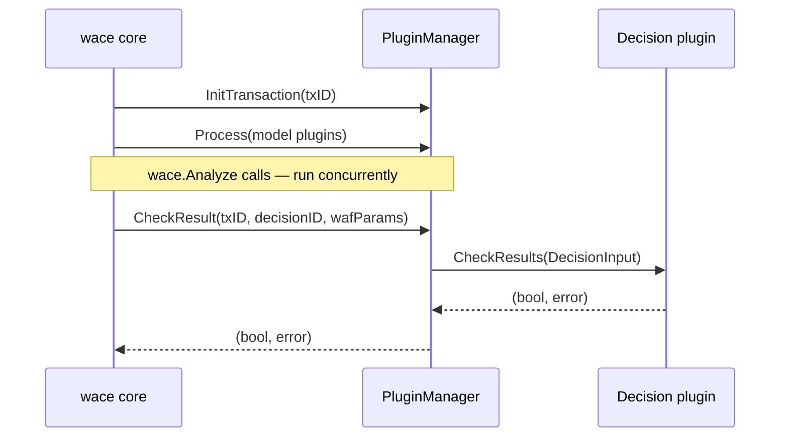

A decision plugin is a Go shared object that receives the aggregated results from all model plugins and produces a final allow/block verdict for the transaction. The `PluginManager` loads decision plugins at startup using Go's `plugin` package, calls `InitPlugin` once to configure the plugin, and then calls `CheckResults` once per transaction when `wace.CheckTransaction` is invoked. Decision plugins are always synchronous and do not use NATS.

## Required exports

Every decision plugin `.so` file must export both of the following symbols with exactly these function signatures.

### InitPlugin

```go
func InitPlugin(params map[string]string, meter metric.Meter) error
```

Called once when the plugin is loaded during `wace.Init`. Use it to read plugin-specific configuration from `params`, initialise any state, and register custom metrics.

| Parameter | Type | Description |
|---|---|---|
| `params` | `map[string]string` | Key-value pairs from the `params` block in the plugin's configuration YAML. |
| `meter` | `metric.Meter` | OpenTelemetry meter for recording decision-level metrics. |

Return a non-nil error to signal a fatal initialisation failure; the `PluginManager` logs a warning and excludes the plugin from the decision registry.

### CheckResults

```go
func CheckResults(input pluginmanager.DecisionInput) (bool, error)
```

Called once per transaction by `wace.CheckTransaction` after all pending `Analyze` calls have completed. The plugin examines model scores and WAF data and returns `true` to block the transaction or `false` to allow it.

| Parameter | Type | Description |
|---|---|---|
| `input` | `pluginmanager.DecisionInput` | Aggregated model results, weights, and WAF anomaly scores. See below. |

Returns `(true, nil)` to block, `(false, nil)` to allow, or `(false, error)` if the plugin cannot evaluate the input.

---

## DecisionInput contents

```go
type DecisionInput struct {
    TransactionId string
    Results       map[string]ModelResults   // keyed by model plugin ID
    ModelWeight   map[string]float64        // keyed by model plugin ID
    WAFdata       map[string]string         // forwarded from wace.CheckTransaction
}
```

<ResponseField name="TransactionId" type="string">
  Identifier of the transaction being evaluated.
</ResponseField>

<ResponseField name="Results" type="map[string]ModelResults">
  Map of model plugin ID to its results. Each `ModelResults` contains
  `ProbAttack float64` (attack probability in `[0.0, 1.0]`) and `Data
  map[string]interface{}` for any additional metadata the model produced.
</ResponseField>

<ResponseField name="ModelWeight" type="map[string]float64">
  Map of model plugin ID to the weight declared in the configuration. Use this
  to implement weighted-average scoring across multiple models.
</ResponseField>

<ResponseField name="WAFdata" type="map[string]string">
  Key-value pairs forwarded directly from the `wafParams` argument of
  `wace.CheckTransaction`. In ModSecurity-based deployments, these keys
  typically include:

  | Key | Example value | Description |
  |---|---|---|
  | `COMBINED_SCORE` | `"0"` | Total ModSecurity anomaly score |
  | `inbound_blocking` | `"20"` | Inbound blocking score |
  | `inbound_threshold` | `"5"` | Inbound threshold for blocking |
  | `outbound_blocking` | `"0"` | Outbound blocking score |
  | `outbound_threshold` | `"4"` | Outbound threshold for blocking |
  | `phase` | `"2"` | ModSecurity processing phase |
  | `XSS` | `"0"` | XSS-specific score |
  | `SQLI` | `"0"` | SQL injection-specific score |
  | `LFI` | `"0"` | Local file inclusion score |
  | `RCE` | `"0"` | Remote code execution score |
</ResponseField>

---

## Example decision plugin

The following example mirrors the logic expected of the `simple` decision plugin used in WACElib tests. It blocks a transaction when either the weighted ML score exceeds a threshold or the WAF's `inbound_blocking` score is above `inbound_threshold`.

```go
package main

import (
    "strconv"

    "github.com/tilsor/ModSecIntl_wace_lib/pluginmanager"
    "go.opentelemetry.io/otel/metric"
)

var mlThreshold float64 = 0.5

// InitPlugin reads configuration parameters.
func InitPlugin(params map[string]string, meter metric.Meter) error {
    if v, ok := params["ml_threshold"]; ok {
        t, err := strconv.ParseFloat(v, 64)
        if err != nil {
            return err
        }
        mlThreshold = t
    }
    return nil
}

// CheckResults combines ML model scores with WAF anomaly data.
func CheckResults(input pluginmanager.DecisionInput) (bool, error) {
    // 1. Compute weighted average of all model attack probabilities
    var weightedScore, totalWeight float64
    for modelID, result := range input.Results {
        w := input.ModelWeight[modelID]
        weightedScore += result.ProbAttack * w
        totalWeight += w
    }
    if totalWeight > 0 {
        weightedScore /= totalWeight
    }

    // 2. Block on ML score alone
    if weightedScore >= mlThreshold {
        return true, nil
    }

    // 3. Also block when the WAF's inbound anomaly score exceeds its threshold
    inboundBlocking, _ := strconv.ParseFloat(input.WAFdata["inbound_blocking"], 64)
    inboundThreshold, _ := strconv.ParseFloat(input.WAFdata["inbound_threshold"], 64)
    if inboundThreshold > 0 && inboundBlocking >= inboundThreshold {
        return true, nil
    }

    return false, nil
}
```

Build command:

```bash
go build -buildmode=plugin -o simple.so ./simple
```

Configuration entry:

```yaml
decisionplugins:
  - id: "simple"
    path: "/usr/lib/wace/plugins/simple.so"
    params:
      ml_threshold: "0.6"
```

---

## Calling sequence

The following diagram shows when `CheckResults` is called relative to the transaction lifecycle:



<Warning>
  Decision plugins are always executed synchronously in the calling goroutine of
  `wace.CheckTransaction`. Avoid blocking I/O inside `CheckResults`; all
  expensive work should be done in model plugins instead.
</Warning>

<Note>
  Decision plugins share the same ABI constraints as model plugins: they must be
  compiled against identical versions of `pluginmanager` and
  `go.opentelemetry.io/otel/metric` as the host WACElib binary.
</Note>
